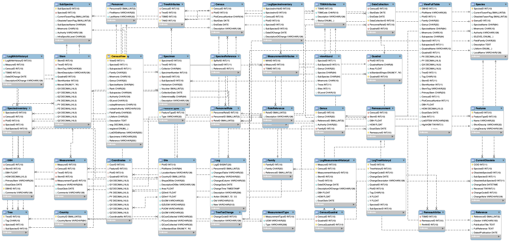

# Barro Colorado

Schema from Scientific project "Complete data from the Barro Colorado 50-ha plot: 423617 trees, 35 years".
The schema was extracted, see source to get the the 800MB of data.

- Version: 10.13
- Source: https://datadryad.org/stash/dataset/doi:10.15146/5xcp-0d46

License CC0 1.0 Universal (CC0 1.0) Public Domain Dedication license.